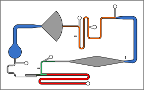

# preparing design files

In order to start analyzing videos, you must first prepare a specially formatted design file to indicate the sections of the chip you want to consider. These design files can be made easily from the original design files used to fabricate the chip in the first place.

<div align="center"></div>

The design file should be an **.svg file** containing:

* An overlay layer (named `overlay`, no caps).

  This layer will be used to align the video footage to the design, so it's probably easiest to include the full design (including the edges of the chip) as solid strokes.

* All of the sections of the chip you want to measure in separate layers.

  These layers should consist of a single continuous shape representing a (portion of a) channel. Each of these layers will be used as a mask in the image processing stage, and must therefore have a solid fill. The color doesn’t matter however.

  The name of these layers will be used as the name of the mask in the configuration of the analysis, legends of the graphs and the column names of the resulting data.

  If you want to ensure a specific order for these layers to go in, you can format the layer names as `1 - …`, `2 - …`, etc.

* A solid white background (named `_background`).

  This layer is included to make sure that there is no transparency when rendering the overlay and masks, as this can mess things up. Adding this background layer explicitly makes us less likely to make mistakes with the ‘global’ background settings, as those can be easily missed.

  In order for the masks to be positioned precisely relative to the overlay, this background layer should *cover the entire image*. To make sure it is sized correctly, it’s best to draw it with respect to the page instead of the design itself. In Inkscape:

  1. Select the overlay

  2. Resize the page to it as follows:

	```
     File > Document > Properties > Resize page to content... > Resize page to drawing or selection
  ```

  3. Turn on `Show page border`

  4. Enable `Snap to page border` in the snap controls bar

  5. In the background layer, draw a rectangle over the page border (solid white fill, no stroke, no transparency)
