# tutorial

### Introduction

To start analyzing microfluidic chips with shapeflow, you need video footage of your chip along with a [formatted design file](./preparing design files.md). The image analysis pipeline consists of the following steps

1. **[Transformation](transforms.md)**

   The design is aligned to the video frame.

2. **Masking**

   Each layer in the design file is used to mask off the corresponding area in the video footage of the chip.

3. **[Filtering](filters.md)**

   The masked off area of the video frame is filtered to retain the portion of interest, i.e. a colored fluid in a channel. This results in a binary image for each mask

4. **[Feature extraction](features.md)**

   Finally, these binary images are processed to extract features. By using designs with known real-world dimensions and mapping  “video coordinates” to “design coordinates”, we can compute features with real-world dimensions from the video footage.

With shapeflow, you can easily queue up, configure, run and compare such analyses.

### User interface

Running `shapeflow.py` starts the backend of the application and opens a new window or tab in your browser with the user interface. Its main features are shown below

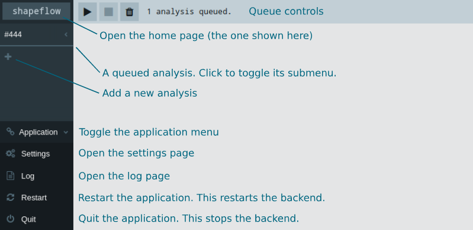

The interface consists of several different pages, which you can navigate between with the sidebar. It also acts as your analysis queue. You can change the order by dragging analyses around the sidebar. 

With the queue controls on the home page you can start and stop the queue (analyses will run from the top to the bottom of the sidebar) or close all of the active analyses.

To add analyses, click on the ‘plus’ button at the bottom of the analysis queue (if you have a lot of analyses queued you may need to scroll down to find it). You’ll see the popup below

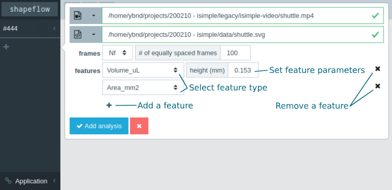

With this form you can select the files, frame settings and features to use for your new analysis. 

You can browse for files by clicking the leftmost button next to the file fields, or select files from a list of previously used ones with the dropdown button. If the files exist and can be read by the application, they will be highlighted in green as shown above. However, if the files show up in red as shown below, they either don’t exist (a typo maybe?) or are not the correct file type.

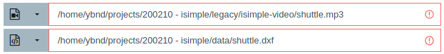

You can set up multiple features for an analysis, and configure any corresponding parameters. Each feature will be shown in a separate graph and will be exported to a separate worksheet after analyzing. See [here](features.md) information about the available features.

#### Analyses

##### 1. Alignment

When you add a new analysis, the align page for that analysis will open so you can start configuring it. With the seek controls in the top bar you can select different frames in the video. In many cases chips may move slightly when pressed during activation, so it’s often best to align the design to a frame after the chip has been activated. If the alignment has not been set yet, you can start by dragging a rectangle as shown below

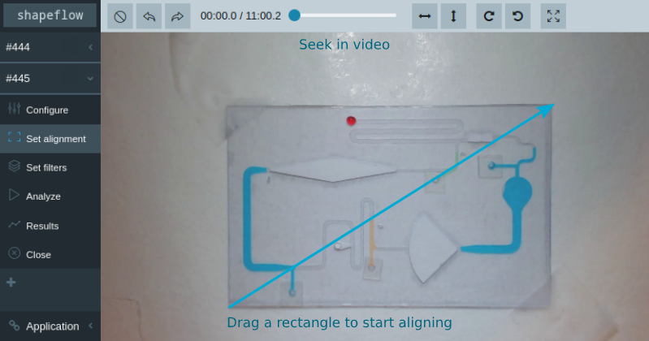

Once the initial alignment rectangle is set, you can adjust it by dragging its edges and corners, or rotating it with its rotation control.

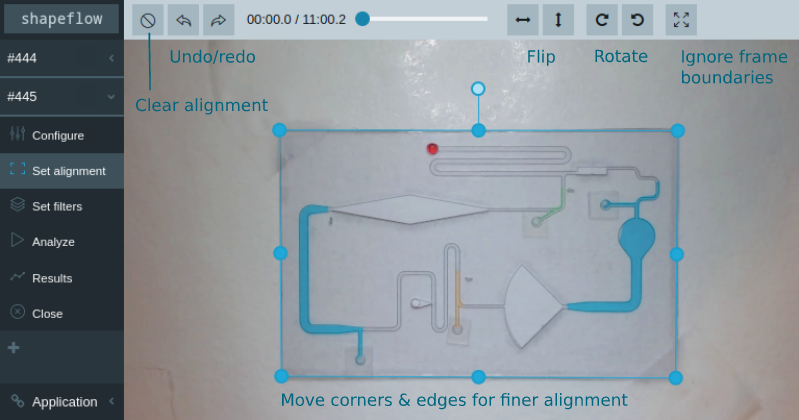

Additionally, you can flip and rotate the design relative to the alignment rectangle with the controls in the top bar. The undo/redo buttons only affect the alignment; any changes you may have made to the rest of the configuration will stay unchanged. Clearing the alignment allows you to draw a new rectangle and start aligning all over again. Finally, you can toggle the frame boundaries, as shown in the image below. This looks wonky, but may be useful for cases where the entire chip doesn’t fit into the frame.

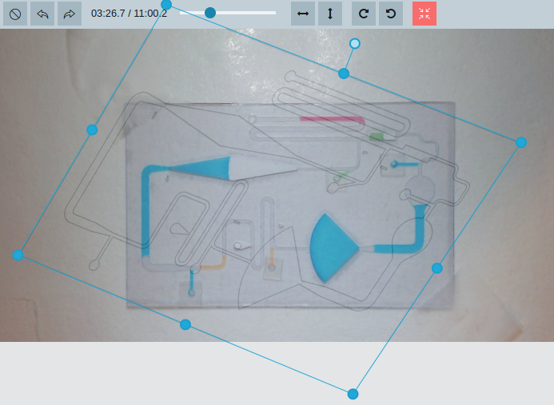

##### 2. Filters

Once you set an alignment, you can start configuring the filters. In each of the design’s masks, you should select the liquid you want to follow to filter that specific color. You can seek through the video to catch every liquid of interest. Masks with no color set are highlighted with a rectangle.

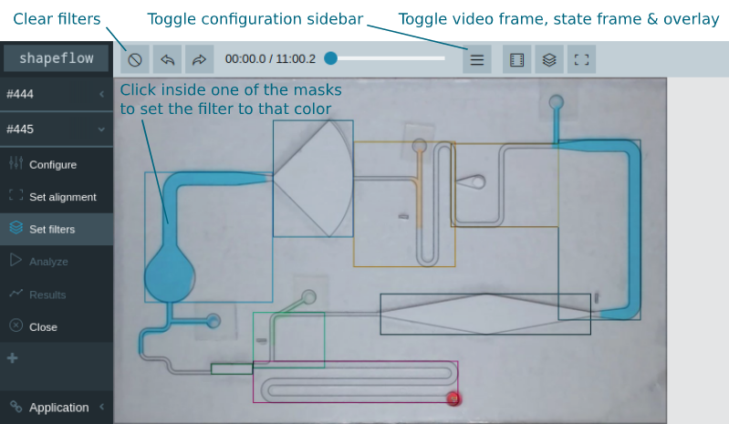

By default, the filter page shows the transformed video frame, the “state frame” (the filtered area of all masks in the design) and the design overlay. To evaluate how well the filters perform, it can be useful to toggle some of these images on and off. For example, you can alternately toggle the state frame to more clearly see how well the filtered area corresponds to the liquid you want to measure.

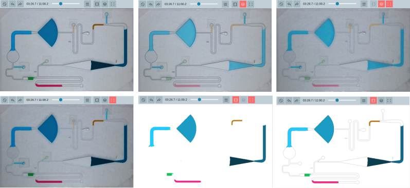

For additional configuration, you can toggle the configuration sidebar as shown above. Here you can configure every mask and filter in the analysis in more detail. See [here](filters.md) for information on the available filters and their options. Checking the ‘skip’ option will skip masks in the analysis. Finally, you can override the global feature parameters for the design for every mask by expanding the ‘parameters’ section.		

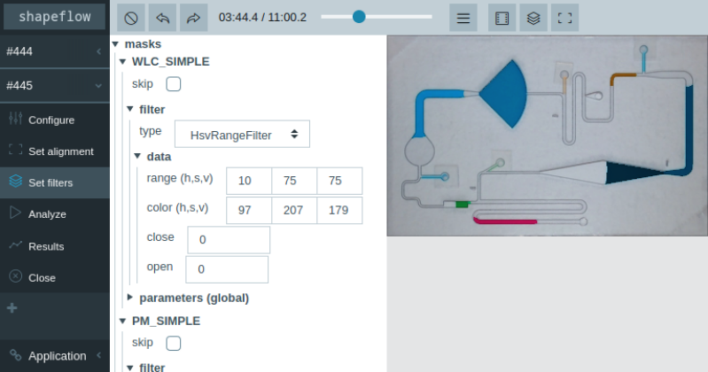

If you see issues with the alignment once you start configuring the filters, you can always navigate back to the alignment page to adjust it.

##### 3. Analyzing and inspecting results

Once all filters are configured (or skipped) you can run the analysis, either by pressing ‘Analyze’ in the analysis submenu, or starting the queue on the home page. A running analysis will show its progress in the sidebar, and becomes green once completed. The ‘Analyze’ button is grayed out when the configuration is incomplete (i.e. the alignment is not set or not all filters are configured) or when an analysis has already been run with the current configuration.

On the results page, you can visualize the results of different runs.

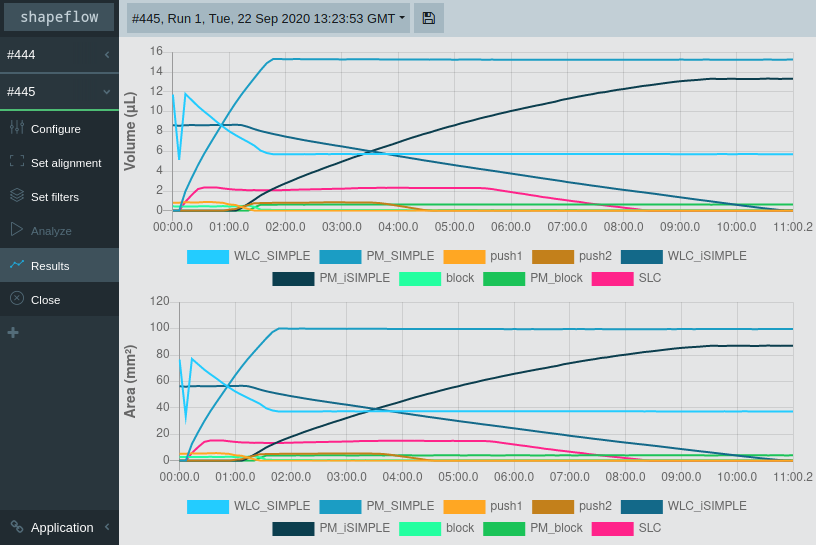

By default, results are exported to .xlsx files after a run is done, but they can also be exported manually with the ‘Save’ button in the top bar. Each .xlsx file has a separate sheet for every feature in the analysis and another sheet with the configuration the run was performed at for future reference.

If there are issues with the results, you can tweak the configuration of the analysis and run it again. The results of multiple runs will be stored so you can compare them.

##### 4. Full configuration

The full configuration of the analysis can be seen and edited on the configure page (shown below)

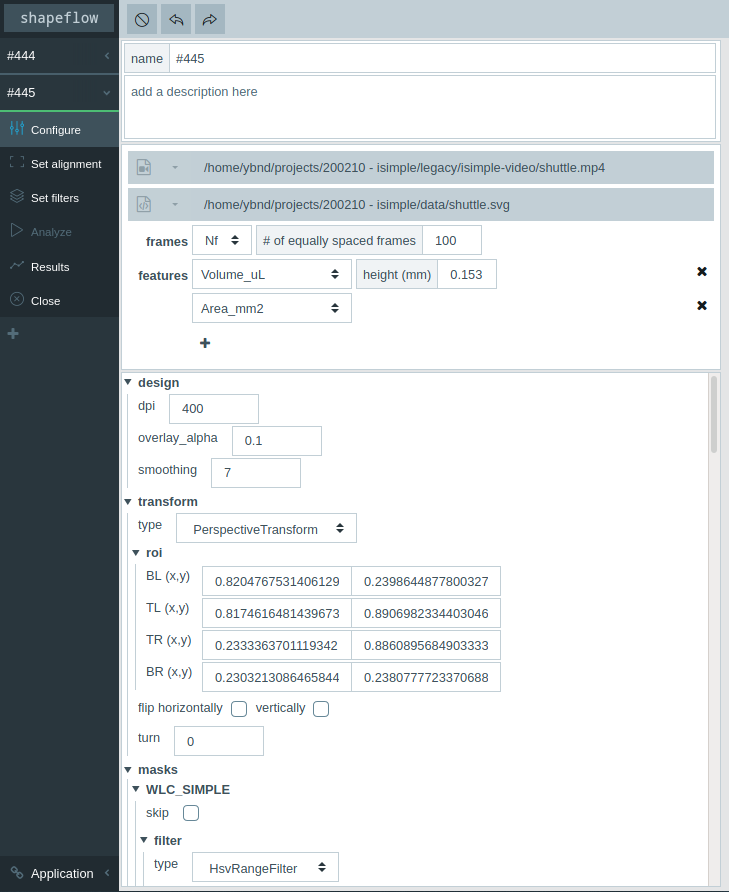

You can change the name of the analysis and add a description and modify the initial configuration you set when creating the analysis. Finally, you have access to the rest of the configuration

* In most cases there is no reason to make changes to the design section
* The transform section can be modified more easily from the alignment page. You’ll find some information on the available transform types [here](transforms.md).
* The masks section can also be accessed from the filter page

### Application settings

On the settings page you can edit the global application settings, as shown below. For changes to the settings to take effect, you must press the ‘Save settings & restart’ button in the top bar. From here, you can also clear the database (this will clear your recent files and remove any analysis results that haven’t been exported yet) and the cache (this will make the application slower for videos you’ve already analyzed). The most relevant settings are explained below

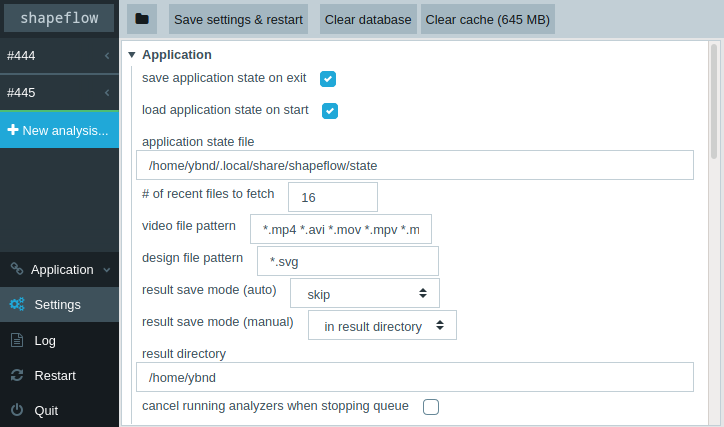

* Application

  * **save/load application state on exit/start**

    When these options are on, any analyses in the queue that have not been completed (i.e. aren’t marked green in the sidebar) will be saved when the application stops and opened again when it stats

  * **\# of recent files to fetch**

    This option sets the amount of video and design files to show in the dropdown menus in the ‘New analysis’ popup

  * **video/design file pattern**

    Adjust the file types to allow when browsing for video or design files. You may want to adjust these if you have video files in a format not listed in the default `*.mp4 *.avi *.mov *.mpv *.mkv` . Patterns should be set as a wildcard `*` followed by a file extension, separated by spaces.

  * **result save mode**

    By setting the (auto) option to ‘skip’, you can disable result export after each analysis. In that case, you can only export from the results page. This may be useful 

  * **cancel running analyzers when stopping queue**

    When this option is on, stopping the queue while an analysis is still running will cancel that analysis. Otherwise, the queue will be stopped once the analysis is complete.
    
  * **\# of threads**

    Number of concurrent threads to run. Requests to the Python backend are handled in parallel; increasing the number of threads may improve the response time in some cases. If you see `WARNING - waitress.queue - Task queue depth is <1,2,...>` in the log, the server is waiting for a thread to finish a request before it can handle a new one. If you get a lot of these warnings, you may want to increase the number of threads you use.

* Cache

  * **cache size limit**

    Because reading individual frames from video files can be relatively slow, the application caches frames in the background. Therefore, re-running an analysis is significantly faster than running it for the first time. Because uncompressed images are weighty, the cache can become large. If you want to conserve disk space, you can set the size limit to a lower value. Conversely, if you think you get slower re-runs when analyzing many different videos, you may want to increase the cache size limit. 
